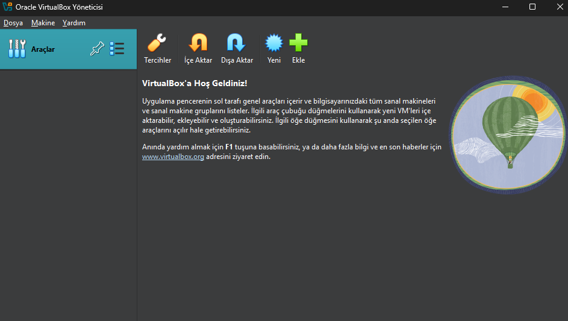

# 🖥️ Sanal Lab Ortamı Kurulumu

Bu kılavuz, **VMware Workstation Player** ve **VirtualBox** kullanarak Ubuntu sanal makinesi oluşturmayı anlatır.

--- 

### **📌 VMware Workstation Player ve VirtualBox Kurulum Linkleri:**

VMWare Workstation Player [buradan](https://www.vmware.com/products/workstation-player.html)

VirtualBox [buradan](https://www.virtualbox.org)

---

## 🔹 **1. VMware Workstation ile Kurulum**  

**VMware Workstation 17 Player** ile Ubuntu kurulumu için aşağıdaki adımları takip edin.

### **📌 VMware Kurulum Adımları:**
1. **Create a New Virtual Machine** seçeneğine tıklayın.
2. Ubuntu ISO dosyanızı seçin.
3. Kullanıcı adı ve şifre belirleyin.
4. Disk boyutunu 20GB olarak ayarlayın.
5. **Finish** butonuna basarak sanal makineyi başlatın.

Daha detaylı bilgi için **[VMware Kurulum Rehberi](VMware/README.md)** bölümüne bakabilirsiniz.

## 🔹 **2. VirtualBox ile Kurulum**  

**VirtualBox** kullanarak Ubuntu sanal makinesi oluşturmak için şu adımları izleyin:

### **📌 VirtualBox Kurulum Adımları:**
1. **New** butonuna tıklayın.
2. Ubuntu 64-bit işletim sistemini seçin.
3. **RAM miktarını 4GB**, disk boyutunu **20GB** olarak belirleyin.
4. Sanal makineyi oluşturun ve Ubuntu ISO dosyanızı bağlayın.
5. **Başlat (Start)** butonuna tıklayarak kuruluma geçin.

Daha detaylı bilgi için **[VirtualBox Kurulum Rehberi](virtualbox/README.md)** bölümüne bakabilirsiniz.

---

## ✅ **Bilgilendirmeler**
- **VMware daha stabil ve gelişmiş özellikler sunarken, VirtualBox daha hafif ve ücretsizdir.**
- **İkisi de sanal test ortamları kurmak için uygundur.**

