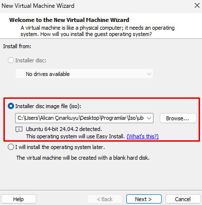

# 🖥️ Sanal Lab Ortamı Kurulumu

Bu kılavuz, NOC mühendisliği için sanal test ortamının nasıl oluşturulacağını anlatır.

## 1️⃣ VMware Workstation Player / VirtualBox Kurulumu
VMware veya VirtualBox'u aşağıdaki linklerden indirerek kurabilirsiniz:
- [VMware Workstation Player](https://www.vmware.com/products/workstation-player.html)
- [VirtualBox](https://www.virtualbox.org/)

Kurulum tamamlandıktan sonra ayarlarınızı aşağıdaki gibi yapılandırın, minimum olması gereken ayarlar:

| Ayar | Değer |
|------|-------|
| RAM  | 4 GB |
| CPU  | 2 Çekirdek |
| Disk | 20 GB |

## 2️⃣ Linux Sanal Makine Kurulumu
- Ubuntu 22.04 ISO dosyasını indirin: [Ubuntu Download](https://ubuntu.com/download)
- VMware veya VirtualBox’ta yeni bir sanal makine oluşturun.
- ISO dosyasını bağlayarak işletim sistemini kurun.

## 3️⃣ Ağ Yapılandırması (NAT & Bridge)
Komut satırında ağ arayüzlerini kontrol edin:
```bash
ip a
```


