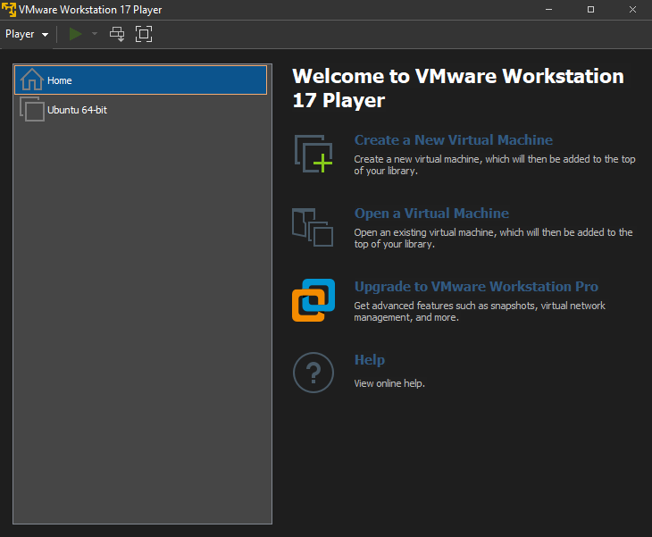
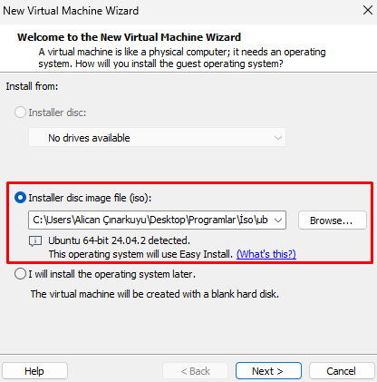
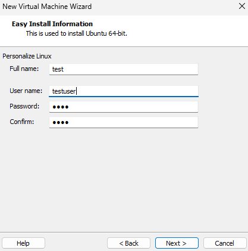
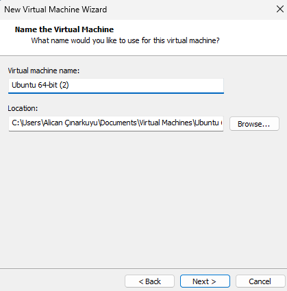
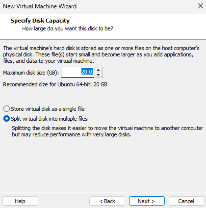

## 1️⃣ VMware Workstation Player Kurulumu
VMware Workstation Player'i aşağıdaki linklerden indirerek kurabilirsiniz:
- [VMware Workstation Player](https://www.vmware.com/products/workstation-player.html)

## 📌 **1. VMware Workstation 17 Player Açma**  
İlk olarak VMware Workstation Player'ı açın.



## 📌 **2. Yeni Bir Sanal Makine Oluşturma**  
VMware ana ekranında **"Create a New Virtual Machine"** seçeneğine tıklayın.



Burada:
- **Installer disc image file (ISO)** seçeneğini işaretleyin.
- Ubuntu 24.04 ISO dosyanızı seçin.
- **Next** butonuna tıklayın.

## 📌 **3. Kullanıcı Bilgilerini Girme (Easy Install Mode)**  
Bu adımda Ubuntu'nun otomatik kurulumu için kullanıcı bilgilerini girin:

- **Full Name:** test (Full isminizi belirleyin)  
- **User Name:** testuser (Kullanıcı adınızı belirleyin)  
- **Password:** (Güvenli bir parola belirleyin)  



**Next** butonuna tıklayarak devam edin.

## 📌 **4. Sanal Makine İsmi ve Konumu Seçme**  
Sanal makineye bir isim verin ve kaydedileceği yeri seçin. Varsayılan olarak **"Ubuntu 64-bit"** olarak gelecektir. 



**Next** butonuna tıklayın.

## 📌 **5. Disk Boyutunu Ayarlama**  
Ubuntu'nun disk boyutunu belirleyin. **20 GB** önerilen boyuttur.  
İki seçenek vardır:
- **Store virtual disk as a single file:** Tek bir büyük disk dosyası oluşturur.
- **Split virtual disk into multiple files:** Daha küçük dosyalara böler (taşınabilirlik için önerilir).



**Next** butonuna tıklayın.

## 📌 **6. Sanal Makineyi Başlatma**  
Son olarak, özet ekranında ayarları kontrol edip **"Finish"** butonuna tıklayın.  
Ubuntu sanal makineniz otomatik olarak kurulmaya başlayacaktır. 🎉  
Ubuntu sanal makineniz başladıkta sonra Ubuntu kurulumunuzu custom bir şekilde yapabilirsiniz.🎉  

## 📌 **7. Sanal Makineyi Özelleştirme ve Ağ Ayarları** 
Bu adımda sanal makinenin virtual machine settings kısmına geliniz:


**Hard Disk (SCSI):** Ubuntu'nun disk boyutunu belirleyin. **20 GB** önerilen boyuttur.  
**Memory:** Ubuntu'nun ram boyutunu belirleyin. **4 GB** önerilen boyuttur.  
**Processors:** Ubuntu'nun işlemci çekirdek boyutunu belirleyin. **4** önerilen çekirdek boyuttur.  
**Sound Card:** Ubuntu'nun ses kartını belirleyin. **Auto detect** olarak kalabilir.  
**Display:** Ubuntu'nun ekran yöneticisini belirler. **Auto detect** olarak kalabilir, ekran üzerinde kasma veya donma problemleri mevcut ise çözünürlük değiştirebilirsiniz.  
**Sound Card:** Ubuntu'nun ses kartını belirleyin. **Auto detect** olarak kalabilir.  
**Network Adapter:** Ubuntu'nun ağ ayarlarını belirler ve önemlidir sanal makinenin internet ayarlarını yapmalıyız yoksa internete açılamayız. Ağ ayarlarını seçerken hangi alanda kullanım yapmak istiyorsanız o alana göre uygun olanı seçmeniz daha iyi olacaktır. Hangi ağ alanı ne iş yapar? 

📌**Ağ alanları:**

1️⃣ **BRİDGED:** Sanal makineyi, fiziksel ağa doğrudan bağlar. Gerçek IP alır. Alanları ise sunucu çalıştırma, fiziksel ağ ile iletişim.  
2️⃣ **NAT (Network Address Translation):** Ana bilgisayarın internet bağlantısını paylaşır, ancak dışarıdan erişilemez. Alanları ise internete erişim yeterli ise, güvenlik açısından izole bir ortam.  
3️⃣ **NAT Network:** NAT ile benzer ama sanal makineler aynı ağda olabilir. Alanları ise izole bir ağda birden fazla sanal makine çalıştırma.  
4️⃣ **Host-Only:** Sanal makine sadece ana bilgisayar ile iletişim kurabilir, internet erişimi yoktur. Alanları ise izole geliştirme/test ortamları, güvenlik araştırmaları.  
5️⃣ **Internal Network:** Sanal makineler kendi iç ağında çalışır, ana bilgisayara erişemez. Alanları ise tamamen izole sanal ağ ortamları.  
6️⃣ **Custom Network (VMnet):** Kullanıcı tarafından özelleştirilebilir sanal ağlar. Alanları ise özel laboratuvar ortamları, karmaşık ağ testleri.  

📌 **Network Adapter** kısmında eğer gerçek seneryolar gerçekleştirecekseniz Bridged(Köprü) seçebilirsiniz.

**VMware | Ubuntu** başarılı bir şekilde kurmuş olacaksınız sonrasında VMware Tools ve tam ekran yapabilmek için iki adet paketi de Ubuntu üzerine yüklemenizi öneririm. 

## VMware Tools
```bash
sudo apt update && sudo apt install open-vm-tools -y
sudo apt install open-vm-tools-desktop -y
```
## VMware Desktop Tools
```bash
sudo apt install open-vm-tools-desktop -y
```

🥳 **VMWare başarılı bir şekilde kurdunuz şimdi test ortamı oluşturabilirsiniz.**
