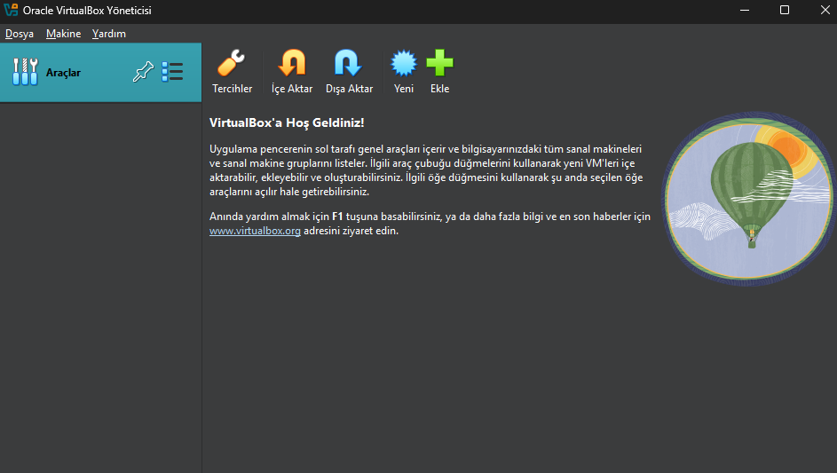
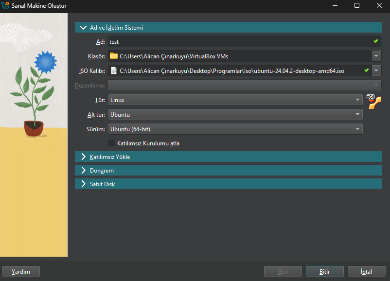
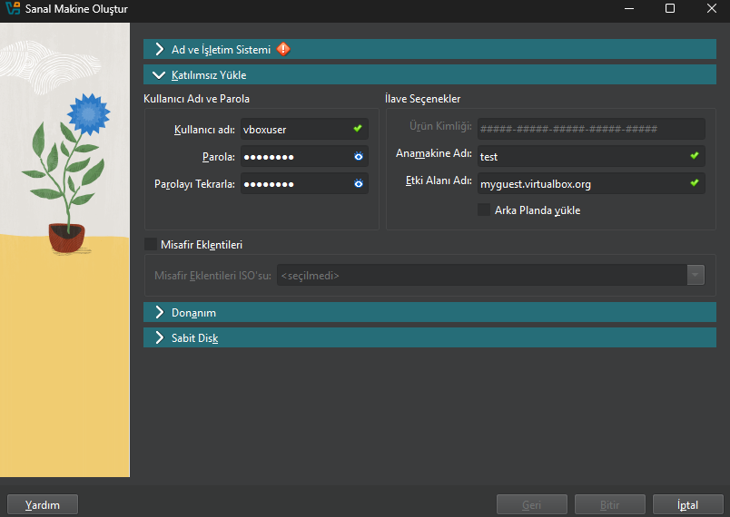
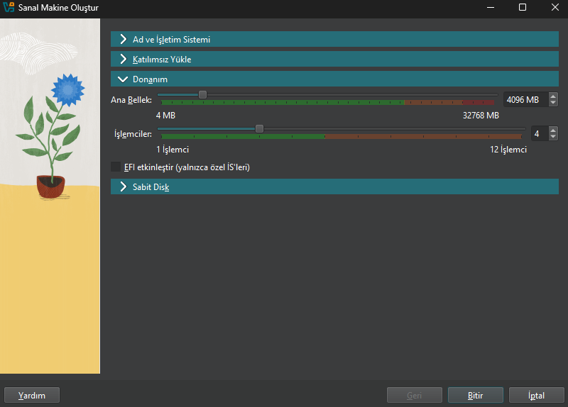
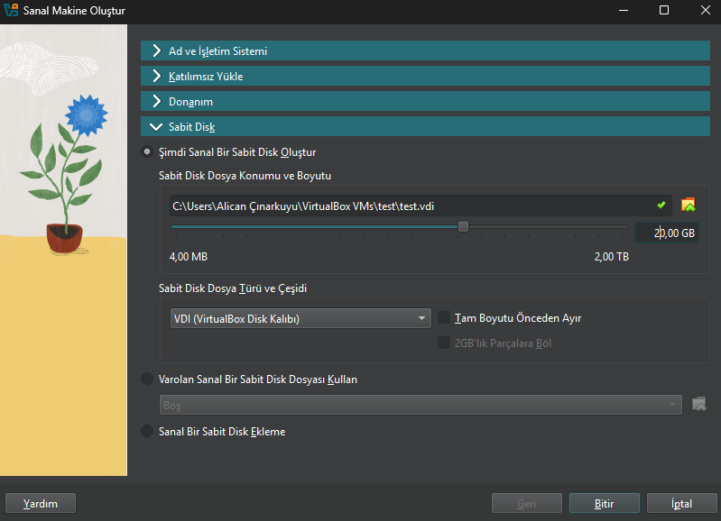
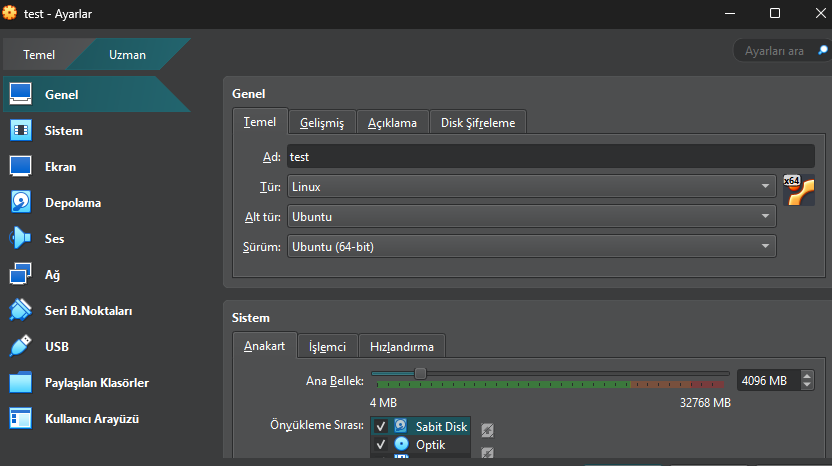

## 1️⃣ VirtualBox Kurulumu
VirtualBox'ı aşağıdaki linklerden indirerek kurabilirsiniz:
- [VirtualBox](https://www.virtualbox.org))

## 📌 **1. VirtualBox'ı Açma**  
İlk olarak VirtualBox'ı açın.

## 📌 **2. Yeni Bir Sanal Makine Oluşturma**  
VirtualBox ana ekranında sağ üst tarafta **"Yeni"** seçeneğine tıklayın.

Burada:
- **Ad** kısmına makine isminizi giriniz. 
- **Klasör** kısmına makinenin kurulu olacağı klasörü seçiniz. 
- **ISO Kalıbı** kısmına Ubuntu İSO dosyamızın olduğu yeri seçmelisiniz.
- **Tür, Alt tür, Sürüm** uygun seçenekleri kendinize göre seçebilirsiniz.
- **Bitir** butonuna tıklayın.

## 📌 **3. Kullanıcı Bilgilerini Girme (Katılımsız Yükle)**  
Bu adımda Ubuntu'nun otomatik kurulumu için kullanıcı bilgilerini girin:

- **Kullanıcı Adı:** vboxuser (Kullanıcı adınızı belirleyin)  
- **Parola:** (Güvenli bir parola belirleyin)  
- **Ana Makine:** test (Ana makine isminizi belirleyin)  
- **Etki ALan Adı:** myguest.virtualbox.org (Alan adınızı belirleyiniz yok ise varsayılan olarak kalabilir.)  

## 📌 **4. Sanal Makine RAM ve CPU Özelleştirme (Donanım)**  
Sanal makineniz için İşlemci çekirdeğini seçmelisiniz. Minimum 2 çekirdek, 4GB RAM tavsiye edilir. 

## 📌 **5. Disk Boyutunu Ayarlama (Sabit Disk)**  
**Şimdi Sanal Bir Sabit Disk Oluştur:** tıklayınız sonrasında alt tarafta sanal sunucunuzun kurulmasını istediğiniz konumu seçiniz. Ubuntu'nun disk boyutunu belirleyin. **20 GB** önerilen boyuttur.  

- **Varolan Sanal Bir Sabit Disk Dosyası Kullan** Elinizde eski veya yedeklenmiş bir sanal disk dosyası (VMDK, VDI, VHD vb.) var ise seçebilirsiniz. 
- **Sanal Bir Sabit Disk Ekleme** Elinizde eski veya yedeklenmiş bir sanal disk var ise kullanabilirsiniz direk olarak.

**Bitir** butonuna tıklayın.

## 📌 **6. Sanal Makineyi Başlatma**  
Son olarak, özet ekranında ayarları kontrol edip **"Bitir"** butonuna tıklayın.  
Ubuntu sanal makineniz otomatik olarak kurulmaya başlayacaktır. 🎉  
Ubuntu sanal makineniz başladıkta sonra Ubuntu kurulumunuzu custom bir şekilde yapabilirsiniz.🎉  

## 📌 **7. Sanal Makineyi Özelleştirme ve Ağ Ayarları** 
Bu adımda sanal makinezin üzerine tıklayarak ayarlar kısmına geliniz:

**Hard Disk (SCSI):** Ubuntu'nun disk boyutunu belirleyin. **20 GB** önerilen boyuttur.  
**Sistem Anakart (RAM):** Ubuntu'nun ram boyutunu belirleyin. **4 GB** önerilen boyuttur.  
**Sistem Anakart (İşlemci):** Ubuntu'nun işlemci çekirdek boyutunu belirleyin. **4** önerilen çekirdek boyuttur.  
**Sistem Anakart (Ekran):** Ubuntu'nun ekran yöneticisini belirler. Ekran üzerinde kasma veya donma problemleri mevcut ise çözünürlük ve görüntü belleğini artırabilirsiniz.  
**Ses:** Ubuntu'nun ses kartını belirleyin. **Varsayılan** olarak kalabilir.  
**Ağ:** Ubuntu'nun ağ ayarlarını belirler ve önemlidir sanal makinenin internet ayarlarını yapmalıyız yoksa internete açılamayız. Ağ ayarlarını seçerken hangi alanda kullanım yapmak istiyorsanız o alana göre uygun olanı seçmeniz daha iyi olacaktır. Hangi ağ alanı ne iş yapar? 

📌**Ağ alanları:**

1️⃣ **BRİDGED:** Sanal makineyi, fiziksel ağa doğrudan bağlar. Gerçek IP alır. Alanları ise sunucu çalıştırma, fiziksel ağ ile iletişim.  
2️⃣ **NAT (Network Address Translation):** Ana bilgisayarın internet bağlantısını paylaşır, ancak dışarıdan erişilemez. Alanları ise internete erişim yeterli ise, güvenlik açısından izole bir ortam.  
3️⃣ **NAT Network:** NAT ile benzer ama sanal makineler aynı ağda olabilir. Alanları ise izole bir ağda birden fazla sanal makine çalıştırma.  
4️⃣ **Host-Only:** Sanal makine sadece ana bilgisayar ile iletişim kurabilir, internet erişimi yoktur. Alanları ise izole geliştirme/test ortamları, güvenlik araştırmaları.  
5️⃣ **Internal Network:** Sanal makineler kendi iç ağında çalışır, ana bilgisayara erişemez. Alanları ise tamamen izole sanal ağ ortamları.  
6️⃣ **Custom Network (VMnet):** Kullanıcı tarafından özelleştirilebilir sanal ağlar. Alanları ise özel laboratuvar ortamları, karmaşık ağ testleri.  

📌 **Network Adapter** kısmında eğer gerçek seneryolar gerçekleştirecekseniz Bridged(Köprü) seçebilirsiniz.

🥳 **VirtualBox | Ubuntu başarılı bir şekilde kurdunuz şimdi test ortamı oluşturabilirsiniz.**
